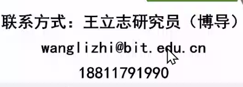

# 对齐

- [X]  选取参考帧
- [X]  处理RAW图
- [ ]  高斯金字塔，模板匹配

## 1. 选取参考帧

根据绿色通道的梯度，在前3帧中选取最锐利的。

## 2. 处理RAW图

输入是Bayer Raw图，四颜色平面是欠采样的，是不适定问题。为了解决这个问题，我们假设偏移量为2像素的倍数。

四色平面：R、G、G、B

欠采样：每平面只有25%有值

通过平均2x2大小的RGGB下采样到3Mpix灰度图

## 3. 层级对齐

选取参考图，并进行欠采样处理后，对其他图进行四层高斯金字塔对齐，从粗到细；每一层采取分块模板匹配。

### 3.1 高斯金字塔

从金字塔底部到顶部进行降采样，分辨率逐渐降低，采样过程：

1. 对$I^l$进行高斯平滑
2. 对$I^{l'}$进行下采样到原图像的一半大小
3. 得到$I^{l+1}$

### 3.2 模板匹配

在参考图的指定范围上滑动待对准图，计算$u,v =\min_{u, v} D_p$

1. 确定图块大小$n*n$，划分图块
2. 滑动图块，计算匹配的位置对应的u,v

$$
\min_{u,v} D_p(u,v) = \min_{u,v} \sum_{y=0}^{n-1} \sum_{x=0}^{n-1} |T(x, y) - I(x+u+u_0, \space y+v+v_0)|^p

$$

- T是待对齐图块
- I是参考图像中的搜索范围
- p是对齐正则化的幂
- n是块的大小
- $(u_0,v_0)$是从较粗层级继承的初始化对齐

